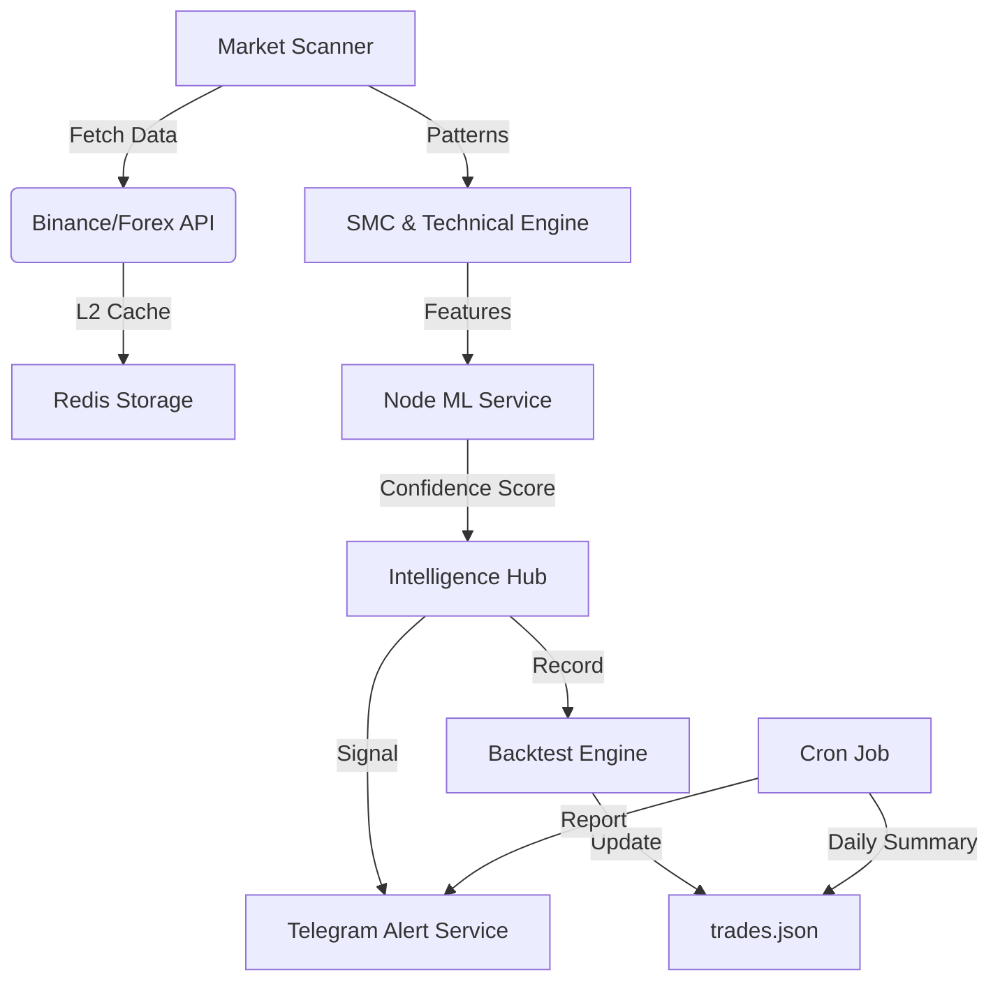

# 🏛️ TREADING AI — Institutional Backend & ML Scanner
[](https://nodejs.org/)
[](#)
[](#)

**Treading AI** is a professional-grade, autonomous market analysis engine built for real-time cryptocurrency and forex scanning. It synthesizes **Smart Money Concepts (SMC)**, high-frequency technical indicators, and **Native Machine Learning** to deliver institutional-quality trade setups via Telegram.

---

## 🌟 Key Features

### 🔍 Advanced Market Scanning
*   **Multi-Asset Support:** Seamlessly scans both Crypto (Binance Futures) and Forex markets.
*   **STRICT MTF Alignment:** Analysis requires 100% agreement across **5m, 15m, 1h, and 4h** timeframes to eliminate fake signals.
*   **Anti-Fake Filtering:** Advanced institutional filters (EMA200 Trap, Spread Filter, Volume Spike confirmation) prevent bad entries.
*   **Symmetrical Dual-Scoring:** Balanced engine ensuring SELL signals are as accurate and frequent as BUY signals.
*   **Dynamic Symbol Selection:** Automatically rotates focus to high-volume symbols from Delta Exchange.

### 🧠 Pure Node.js ML Infrastructure
*   **Local Random Forest Engine:** Zero-dependency ML using `ml-random-forest`, eliminating Python bottlenecks.
*   **Triple-Target Prediction:** Predicts probabilities for **Breakouts**, **Trend Continuations**, and **Mean Reversals**.
*   **Hot-Reloading Models:** Train and swap AI models in real-time without restarting the scanner core.
*   **Accuracy Tracking:** Real-time metadata tracking for model performance and confidence intervals.

### 🛡️ Smart Money Concepts (SMC) & ICT
*   **Structure Mapping:** Automated detection of **BOS** (Break of Structure) and **CHoCH** (Change of Character).
*   **Liquidity Scanners:** Identifies retail stops and institutional liquidity pools.
*   **Orderbook Depth Analysis:** Integrates real-time bid/ask imbalance into signal scoring.

### 📊 Performance & Automation
*   **Real-Time Backtester:** Automatically tracks every signal in `trades.json`, monitoring price action for TP/SL hits.
*   **Daily AI Reports:** Automated Telegram reports sent via `node-cron` summarizing wins, losses, and daily win rates.
*   **L2 Redis Caching:** High-performance caching layer to reduce API latency and prevent rate-limiting.
### 🖥️ Institutional Visual Console
*   **Live Multi-TF Tracking:** See 5m, 15m, 1h, and 4h scores in real-time as the scanner moves through symbols.
*   **Action Emojis:** 🔍 (Scanning), 🔥 (Momentum Detected), 🎯 (4-TF Confluence Alert).
*   **Line-Clearing Updates:** Clean terminal experience with dynamic line-clearing to prevent text clutter.

---

## 🏗️ System Architecture (No-DB Storage)

The system is designed for maximum speed and minimal maintenance by utilizing a high-performance **JSON Storage Layer** (No-DB).



---

## 📁 Project Structure

```text
backend/
├── config/                  # System & Strategy Configurations
├── memory/                  # JSON Persistence (Trades, Signals, Cache)
├── ml_node/                 # Trained Random Forest Models
├── redis/                   # Caching Logic
├── scanner/                 # Analysis Core (Technical, SMC, Scanner)
├── services/                # External APIs & Telegram Integration
├── scripts/                 # Data Generation & Utility Tools
└── server.js                # Express API & Scanner Entry Point
```

---

## 🛠️ Installation & Usage

### 1. Setup
```bash
npm install
# Copy .env.example to .env and fill in your keys
```

### 2. Execution
*   **Scanner:** `npm run dev`
*   **Train AI:** `node train_node_ml.js`
*   **Generate Data:** `node scripts/generateTrainingData.js`

### 3. Training Workflow
To refresh the AI "Brain":
1.  Run `generateTrainingData.js` to fetch fresh historical data.
2.  Run `train_node_ml.js` to build new `ml-random-forest` models.
3.  The scanner will automatically pick up the new models—**no restart needed.**

---

## 🕒 Automation Schedule
*   **Market Scan:** Every 30 seconds (configurable).
*   **Daily Performance Report:** 23:00 IST.
*   **Symbol Refresh:** Every 10 scan cycles.

---

## ⚖️ License
Proprietary — Developed for Treading AI.

